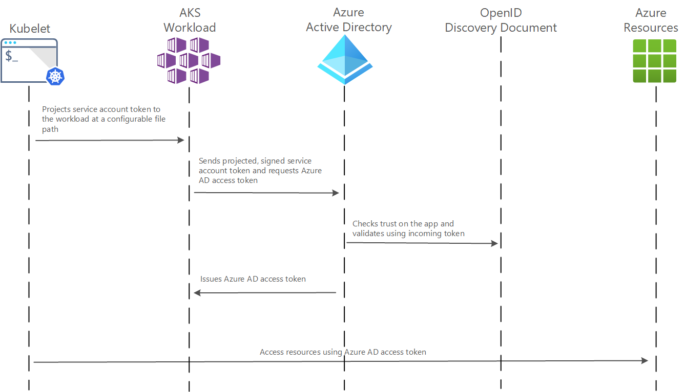
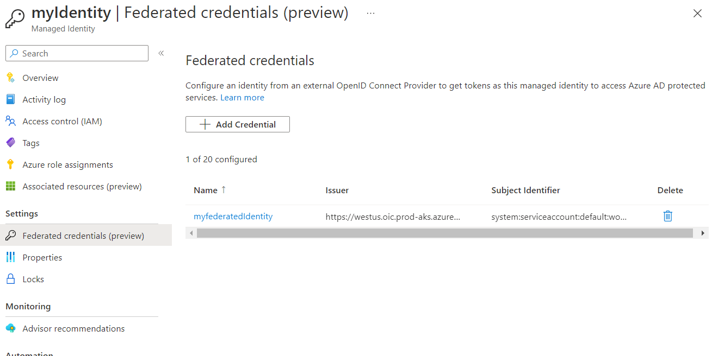

# Module 1 - Workload Identity

Workload Identity allows pods to access Azure resources using Azure managed identity and removes the need to store any secret.  For example, a workload that may store files in Azure Storage, and when it needs to access those files, the pod authenticates itself against the resource as an Azure managed identity.

Workload Identity for AKS integrates with the Kubernetes native capabilities to federate with any external identity providers.

The feature sunsets the existing pod-managed identity makes it easier to use and deploy, and overcomes several limitations in Azure AD pod-managed identity.




## Enabling Workload Identity

> **Note**
> As of Feb. 2023, this feature is in public preview, with expectations that GA is soon, so the following 'Register preview providers' section will not be required once the feature is GA.

Set the following environment variables in your bash session:

``` 
    $RG_NAME=<Resource Group Name where AKS cluster lives>
    $SUBSCRIPTION_ID=<SubscriptionID>
    $LOCATION=<location of AKS cluster>
    $KEYVAULT_NAME=<Must be a unique keyvault name>
    $CLUSTER_NAME=akscluster
    $KEYVAULT_SECRET_NAME=mysecret
```
    
### Register preview providers on your subscription


1. Run the following command to register the preview provider feature Workload Identity:

```
az feature register --namespace "Microsoft.ContainerService" --name "EnableWorkloadIdentityPreview"
```

2. Wait for the feature to be enabled by running this command, the state should show "Registered" when complete. This may take up to 10 minutes

```
az feature show --namespace "Microsoft.ContainerService" --name "EnableWorkloadIdentityPreview"
```

3. Register Microsoft.ContainerService resource provider.
   
```
az provider register --namespace Microsoft.ContainerService
```

4. Add and/or update the aks-preview extension with the Azure CLI.
``` 
az extension add --name aks-preview 
az extension update --name aks-preview
```

### Enable ODIC and Workload Identity on the AKS Cluster

<!-- Internal Ref note: Consider changing this to update in the Bicep template instead of running by CLI.
-->

1. Execute the following CLI command to enable oidc-issuer and to enable workload identity.

```
     
az aks update --resource-group $RG_NAME --name $CLUSTER_NAME --enable-oidc-issuer --enable-workload-identity

```

2. Set the ODIC Issuer URL to a variable
   
``` 
export AKS_OIDC_ISSUER="$(az aks show -n $CLUSTER_NAME -g $RG_NAME --query "oidcIssuerProfile.issuerUrl" -otsv)"
echo $AKS_OIDC_ISSUER
``` 

### Create a managed identity and grant permission to Azure Keyvault

1. Create Managed Identity
   
```
export USER_ASSIGNED_IDENTITY_NAME="workshop-Identity"
az identity create --name "${USER_ASSIGNED_IDENTITY_NAME}" --resource-group "${RG_NAME}" --location "${LOCATION}" --subscription "${SUBSCRIPTION_ID}"
```

2. Create a Secret in Keyvault
   
```
az keyvault secret set --vault-name "${KEYVAULT_NAME}" \
       --name "${KEYVAULT_SECRET_NAME}" \
       --value "LevelUp Lab Secret\!"
```

3. Create Access Policy against Keyvault
   
```
export USER_ASSIGNED_CLIENT_ID="$(az identity show --resource-group "${RG_NAME}" --name "${USER_ASSIGNED_IDENTITY_NAME}" --query 'clientId' -otsv)"
    
az keyvault set-policy --name "${KEYVAULT_NAME}" --secret-permissions get --spn "${USER_ASSIGNED_CLIENT_ID}"
```


#### Create a Service Account and Establish Federated Identity

1. Connect to AKS cluster
```
az aks get-credentials --resource-group rg-aks-gha  --name aksbicep --admin
```

1. Deploy Service Account
```
export SERVICE_ACCOUNT_NAME="workload-identity-sa"
export SERVICE_ACCOUNT_NAMESPACE="default"

cat <<EOF | kubectl apply -f -
apiVersion: v1
kind: ServiceAccount
metadata:
  annotations:
    azure.workload.identity/client-id: "${USER_ASSIGNED_CLIENT_ID}"
  labels:
    azure.workload.identity/use: "true"
  name: "${SERVICE_ACCOUNT_NAME}"
  namespace: "${SERVICE_ACCOUNT_NAMESPACE}"
EOF
```

3. Establish Federated Identity

```
az identity federated-credential create --name myfederatedIdentity --identity-name "${USER_ASSIGNED_IDENTITY_NAME}" --resource-group "${RG_NAME}" --issuer "${AKS_OIDC_ISSUER}" --subject system:serviceaccount:"${SERVICE_ACCOUNT_NAMESPACE}":"${SERVICE_ACCOUNT_NAME}"
```

Navigate to your cluster resource group, and you will now see an identity. Click the Identity resource and select the "Federated credentials" blade under Settings.




#### Deploy Sample workload & Test

<!--
Internal note: Should this de deployed by github action instead?
--->


1. Execute the following to deploy a sample Go application that writes to the log the content of the secret inside keyvault. The Go application expects two environment variables for the Kevault URL and the Keyvault secret name references.

Note the following required annotations on the K8S YAML configuration:
- azure.workload.identity/use: "true"
- serviceAccountName: ${SERVICE_ACCOUNT_NAME}

```
export KEYVAULT_URL="$(az keyvault show -g ${RG_NAME} -n ${KEYVAULT_NAME} --query properties.vaultUri -o tsv)"

cat <<EOF | kubectl apply -f -
apiVersion: v1
kind: Pod
metadata:
  name: quick-start
  namespace: ${SERVICE_ACCOUNT_NAMESPACE}
  labels:
    azure.workload.identity/use: "true"
spec:
  serviceAccountName: ${SERVICE_ACCOUNT_NAME}
  containers:
    - image: ghcr.io/azure/azure-workload-identity/msal-go
      name: oidc
      env:
      - name: KEYVAULT_URL
        value: ${KEYVAULT_URL}
      - name: SECRET_NAME
        value: ${KEYVAULT_SECRET_NAME}
  nodeSelector:
    kubernetes.io/os: linux
EOF

```

2. Check the pod deployment and logs to ensure it has read the secret from keyvault:
Check to see the pod is running:
```
kubectl get pods quick-start
```
Once the pod is running, ensure the pod is showing the KeyVault secret:
```
kubectl logs quick-start
```

If it was successful, you will see the following message:
<pre>
I0213 23:37:08.149572       1 main.go:63] "successfully got secret" secret="LevelUp Lab Secret\\!"
</pre>

This completes the hands-on lab.

#### Troubleshooting

In the case you do not see the above logs, validate the environment variables and delete/re-deploy the application.

For troubleshooting the azure-workload-identity components, you can view and isolate errors from logs with the following command:

```
kubectl logs -n kube-system -l azure-workload-identity.io/system=true  --since=1h | grep ^E
```

#### Optional - Update Bicep template

- TBD