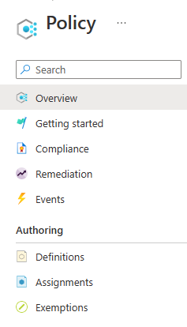
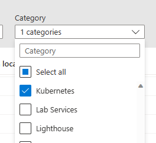

# Module 5: Lab 2 - Azure Policy
Here, in this lab, as part of [Module 5: Operate and Monitor](index.md), we will look at [Azure Policy for Kubernetes](https://learn.microsoft.com/en-us/azure/governance/policy/concepts/policy-for-kubernetes).

Before attempting this lab, please be sure to complete the items described in the [Getting Started Section](index.md#getting-started).

## Azure Policy for Kubernetes
Azure Policy is a feature of the Azure Resource Management Platform which allows organizations to define and enforce stanards across their environments.  Azure Policy for Kubernetes is a Kubernetes add-on that works with Azure Policy.  The add-on extends extends [Gatekeeper](https://github.com/open-policy-agent/gatekeeper) v3, an _admission controller webhook_ for [Open Policy Agent](https://www.openpolicyagent.org/) (OPA).  Once installed, the add-on does the following:

- Check with Azure Policy Service for policy assignments to the cluster
- Deploys policy definitions into the cluster as [constraint template](https://open-policy-agent.github.io/gatekeeper/website/docs/howto/#constraint-templates) and [constraint](https://github.com/open-policy-agent/gatekeeper#constraints) custom resources
- Reports auditing and compliance details back to the Azure Policy Service

### Enable Azure Policy for Containers
To begin, check to see if Microsoft.PolicyInsights is registered in your Azure Subscription:
```bash
az provider show --namespace Microsoft.PolicyInsights
```

If the provider is not present, you must register it:

```bash
az provider register --namespace Microsoft.PolicyInsights
```

Next, let's return to the AKS Cluster and install the add-on:

```bash
az aks enable-addons --resource-group $resourceGroupName --name $clusterName --addons azure-policy
```

Then, verify that the add-on has been installed:

```bash
az aks show --resource-group $resourceGroupName --name $clusterName--query addonProfiles.azurepolicy
```

The output should resemble the following:
```bash
{
    // ...
    "enabled": true,
    // ...
}
```

### Using Azure Policy for Kubernetes
Azure Policy for Kubernetes may be viewed and managed through the Azure Portal.  Simply open Azure Policy and navigate to the Definitions tab in the Authoring section.



Expand the Category filter and clear all the checked items except for Kubernetes.  This will filter the view down to just Azure Polciy for Kubernetes Definitions and Initiatives.  (Simply put, an Initiative is a collection of one or more Definitions applied to a particular scope, like a Resource Group.)



Azure Policy for Kubernetes provides some pre-defined iniatives.  Let's open and apply one to our infrastructure.  Find the "Kubernetes cluster pod security baseline standards for Linux-based workloads" and click it.  It will help if you apply a filter where "CategoryType = Initiative."


You will see that the selected Initiative is comprised of five Policy Definitions.  Notice that one is titled, `Kubernetes cluster should not allow privileged containers.`  Let's assign this initiative to our Cluster's Resource Group.  

Click the `Assign` button located at the top of the Initiative tab.


You will be preseted with the Portal's Assign Initiative wizard.  On the Basics Tab, use the Scope control to select your Cluster's Resource Group.

Then, on the Parameters tab, uncheck the `Only show parameters that need input or review` checkbox.  This will update the screen and you will be able to change the value of the `Effect` control.  Change `Effect` from `Audit` to `deny`.

Then, click `Review + create` followed by `Create`.  This will apply the Initiative, however, it may take up to thirty minutes for the changes to be reflected on your Cluster.  

Once the Initiative is in place, you can test it out by doing the following:

First, let's create a namespace to hold our work.

```bash
kubectl create namespace azurepolicytest
kubectl config set-context --current --namespace azurepolicytest
```

Next, let's run an interactive bash Pod on the cluster in privileged mode:

```bash
kubectl run test-shell --rm -i --tty --privileged=true --image ubuntu -- bash
```

This previous command should fail due to our new Azure Policy for Kubernetes Initiative.

```bash
Error from server (Forbidden): admission webhook "validation.gatekeeper.sh" denied the request: [azurepolicy-k8sazurev2noprivilege-bba3aab5a745b0e81725] Privileged container is not allowed: test-shell, securityContext: {"privileged": true}
```

Now, let's clean up our cluster:

```bash
kubectl delete namespace azurepolicytest
kubectl config set-context --current --namespace default
```

### Update Bicep Templates (Optional)
Now that we have enabled Azure Policy for Kubernetes, let's go back and update our Bicep tempaltes in order to make sure our deployment process picks up the changes.

Add the following to your Bicep template:

```bash
// add the following to addonProfiles
"azurepolicy": {
    "enabled": true
},
```

### Conclusion
This completes Lab 2 - Azure Policy.  If you would like, you may continue by completing [Lab 3 - Defender for Containers](Lab03.md), or return to [Lab 1 - Container Insights](Lab01.md), or the [Introduction](index.md).