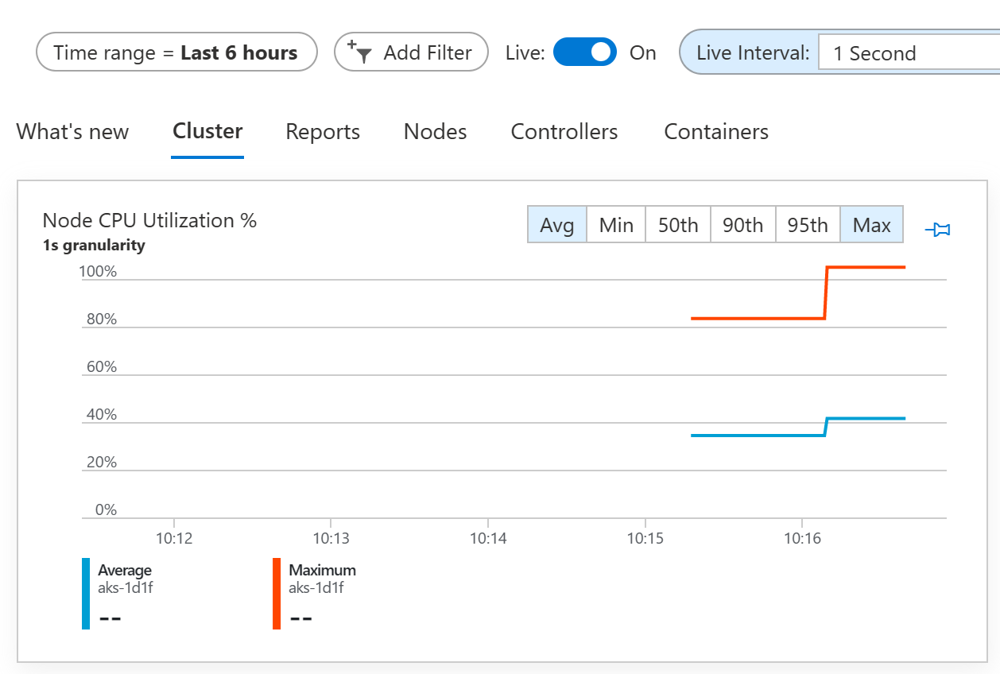
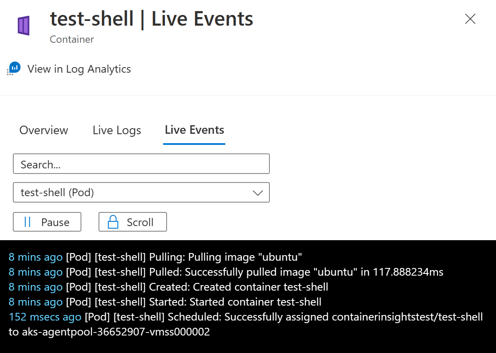

# Module 5: Operate and Monitor AKS
In this module you will learn how to operate and monitor Azure Kubernetes Service.  You will learn about [Container Insights](https://learn.microsoft.com/en-us/azure/azure-monitor/containers/container-insights-overview), [Defender for Containers](https://learn.microsoft.com/en-us/azure/defender-for-cloud/defender-for-containers-introduction), and [Sentinel](https://learn.microsoft.com/en-us/azure/sentinel/overview).

## Container Insights
Container Insights is a feature designed to monitor the performance of container workloads deployed to the cloud. It gives you performance visibility by collecting memory and processor metrics from controllers, nodes, and containers that are available in Kubernetes through the Metrics API. After you enable monitoring from Kubernetes clusters, metrics and Container logs are automatically collected for you through a containerized version of the Log Analytics agent for Linux. Metrics are sent to the [metrics database in Azure Monitor](https://learn.microsoft.com/en-us/azure/azure-monitor/essentials/data-platform-metrics). Log data is sent to your [Log Analytics workspace](https://learn.microsoft.com/en-us/azure/azure-monitor/logs/log-analytics-workspace-overview).

### Enable Container Insights
Container Insights is designed to store its data in a [Log Analytics workspace](https://learn.microsoft.com/en-us/azure/azure-monitor/logs/log-analytics-workspace-overview).  You can let the enablement process create a Log Analytics workspace for this purpose, or if you already have a workspace, you can use that one.  See [Designing your Azure Monitor Logs deployment](https://learn.microsoft.com/en-us/azure/azure-monitor/logs/workspace-design) to learn more about best practices for Log Analytics.

Here, let's begin by creating a Log Analytics workspace in order to support Container Insights.  Right now, we will do this using the Azure CLI.  Later, we will augment our Bicep templates in order to perform this same work.

```
az monitor log-analytics workspace create --resource-group $GROUP --workspace-name $WORKSPACE
WORKSPACEID=$(az monitor log-analytics workspace show --resource-group $GROUP --workspace-name $WORKSPACE --query id -o tsv)
```

Now, let's augment our cluster and enable Container Insights.

```
az aks enable-addons -a monitoring --resource-group $GROUP --name $CLUSTER --workspace-resource-id $WORKSPACEID
```

Let's verify that the Container Insights agent and solution were successfully deployed.  First, we'll verify the daemonset was deployed:

```
kubectl get daemonset ama-logs --namespace=kube-system
```

The output should resemble the following:

```
NAME       DESIRED   CURRENT   READY   UP-TO-DATE   AVAILABLE   NODE SELECTOR   AGE
ama-logs   3         3         3       3            3           <none>          45m
```

Next, we'll verify that the deployment was created:

```
kubectl get deployment ama-logs-rs --namespace-kube-system
```

The output should resemble the following:

```
NAME          READY   UP-TO-DATE   AVAILABLE   AGE
ama-logs-rs   1/1     1            1           47m
```

Now that Container Insights has been enabled, we can turn our attention to the Azure Portal and see the results of our labor.  (It may take a few minutes for data to flow into the Log Analytics workspace.)

Within the Portal, navigate to the cluster.  Once inside the cluster, check out the Monitoring section of the menu system and open the Insights tab.  Here, you will be presented with a nice visualization of your cluster, showing node count, CPU, and memory utilization.  You'll also a graph showing the active pod count.  These views are dynamic.  You can change the time range, or even look at live data from the cluster.


Aside from the Cluster view within the Insights tab, you will find lists that desscribe your cluster's nodes, controllers and containers.  You will also find a tab dedicated to reports.  These data driven reports provide additional insight into your cluster nodes, resource utilization, networking, and billing.

Now, let's take a moment and test Container Insights by applying some load to our cluster.

First, let's create a namespace to hold our work.

```
kubectl create namespace containerinsightstest
kubectl config set-context --current --namespace containerinsightstest
```

Next, let's run an interactive bash Pod on the cluster:

```
kubectl run test-shell --rm -i --tty --image ubuntu -- bash
```

Now, within the test-shell Pod, update, install and run stress:

```
apt update
apt install stress
stress -c 10
```

The above commands will generate a sustained CPU spike in the cluster.  Return to Container Insights and view the Cluster tab.  Turn on Live updates and you should see the Node CPU Utilization graph jump as a result of the stress command.



Next, change the view by clicking on the Nodes tab.  Here, you will see a summary of what's happening inside the cluster.  Notice that one of your nodes (The one running stress) should be much more busy than the others.


Find the node that appears to be the most busy in your cluster and expand its line item.  Here, you will see a list of the processes running on that node.  You should see our test-shell pod running stress at the top of this list.


Next, change the view by clicking on the Containers tab.  Here, you will be presented with a list of containers running on the cluster.  Notice that our test-shell pod is at the top of the list.


Select the test-shell container and you'll get a description of the container.


Here, you can also see a live stream of the container console and events.



Return to test-shell and type ctrl-c to terminate stress.  Then, exit the pod.

```
exit
```

Now, let's clean our cluster:

```
kubectl delete namespace containerinsightstest
kubectl config set-context --current --namespace default
```

Now that we have enabled Container Insights, let's go back and update our Bicep tempaltes in order to make sure our deployment process picks up the changes.

First, add the Log Analytics workspace to the template:

```
// Parameters...

@description('Log Analytics Workspace name')
param workspaceName string

// Log Analytics Workspace Definition 
resource workspace 'Microsoft.OperationalInsights/workspaces@2022-10-01' = {
  name: workspaceName
  location: location
}

// Cluster Definition...
```

Next, adjust the AKS cluster and enable Container Insights:

```
// Inside Cluster Definition; add the following to properties

    addonProfiles: {
      omsAgent: {
        enabled: true
        config: {
          logAnalyticsWorkspaceResourceID: workspace.id
        }
      }
```

## Defender for Containers
Defender for Containers is a cloud-native solution that may be used to secure your containers, helping you to improve, monitor, and maintain the security of your clusters, containers, and their applications.

Defender for Containers assists you with the three core aspects of container security:
- Environment hardening - protects your Kubernetes clusters whether they're running Azure Kubernetes Service, Kubernetes on-premises/IaaS, or Amazon EKS.  Defender for Contaniners continuously assesses clusters to provide visibility into misconfigurations and guidelines to help mitigate identified threats.
- Vulnerability assessment - tools to manage and assess images stored in container registries and running in Azure Kubernetes Service
- Run-time theat protection for nodes and clusters - threat protection for clusters and Linux nodes generates security alerts for suspicious activities

You can learn more by reading the [documentation](https://learn.microsoft.com/en-us/azure/defender-for-cloud/defender-for-containers-introduction), or watching this video from the Defender for Cloud in the Field video series: [Microsoft Defender for Containers](https://learn.microsoft.com/en-us/azure/defender-for-cloud/episode-three).

### Enable Defender for Containers
To begin, open the Azure Portal and navigate to [Defender for Cloud](https://learn.microsoft.com/en-us/azure/defender-for-cloud/defender-for-cloud-introduction) - your Cloud Security Posture (CSPM) and Cloud Workload Protection Platform (CWPP).


The Defender for Cloud Overview tab will open and you'll find a dashboard describing your security posture, regulatory compliance, and more.  For now, turn your attention to the Management section of the navigation menu and click on Environment Settings.

From within the Environment Settings tab, you will be presented with an expandable list of your Azure Management Groups and their associated resources.  Find and open your Azure Subscription in this list.  You will be taken to a view that shows a list of all the Defender plans available to your subscription and their status.

If the Containers Plan is not enabled, enable it. 


A Settings link will appear within the description of your Defender for Containers plan.  Click it.


Here, you have the ability to toggle automatic installation/application of Defender for Cloud components, such as the Defender DaemonSet and Azure Policy for Kubernetes.


## Sentinel